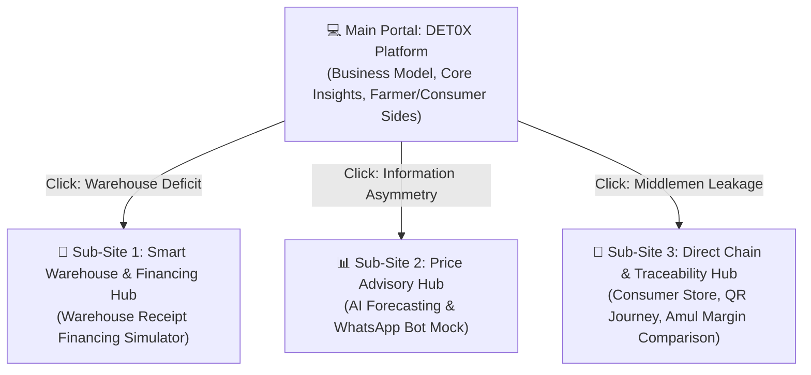

# Project Blueprint: Multi-Site Value Chain Restructuring Portal

This document outlines the **3-Phase Blueprint** to build a multi-page web platform addressing the agricultural value chain bottlenecks in India. The platform consists of a **Main Portal** explaining the high-level business model, linking out to **3 specialized sub-sites** (interactive prototypes) targeting specific issues.

---

## 🗺️ System Architecture Overview

---

## 📅 Three-Phase Roadmap

### 🚀 Phase 1: Blueprint & Design System
*Focus: Visual layouts, typography, content maps, and the green/white agricultural design identity.*

#### 1. Main Landing Portal
*   **Hero Section**: Bold value proposition statement, overview of the FPO Operating System, and entry buttons to the two perspectives: **Farmer Side** and **Customer Side**.
*   **The Moat (What Predecessors Got Wrong)**: Clear breakdown of Ninjacart's and DeHaat's shortcomings vs. DET0X's structural changes.
*   **Market Opportunity Dashboard**: Real horticulture data (production vs. wastage), market share potential, and total margins saved (Amul benchmark).

#### 2. Sub-Site 1: Smart Warehouse & Financing Hub (Smart Warehouse)
*   **The Problem**: First-mile storage deficit and distress selling.
*   **Proposed Method**: FPO-level solar micro cold storage + instant credit lines.
*   **What Will Become**: Interactive ROI calculator for farmers (Crop, quantity, harvest-low price vs. peak price, storage cost, loan interest, net profit gain).

#### 3. Sub-Site 2: Price Intelligence & Advisory Hub (Price Advisory)
*   **The Problem**: Lack of price visibility and market manipulation by local traders.
*   **Proposed Method**: Cross-mandi pricing engines + predictive models + localized WhatsApp alerts.
*   **What Will Become**: Interactive charts showing 7-day price forecasts and a mock WhatsApp chat simulating farmer-advisor query flows.

#### 4. Sub-Site 3: Direct Value Chain & Traceability Hub (Direct Value Chain)
*   **The Problem**: Quality trust deficit and multiple middleman markups.
*   **Proposed Method**: Direct-to-retail supply chain + blockchain-backed QR journey tracking.
*   **What Will Become**: A mock e-commerce portal for retail buyers where scanning/clicking a product QR shows its full journey (farm, storage temp logs, transport route, quality certifications) and demonstrates why they pay a 25% premium.

---

### 💻 Phase 2: Core Development & Interactive Prototypes
*Focus: Development of the Next.js application, interactive widgets, charts, and simulation logic.*

#### 1. Next.js Tech Stack Configuration
- **Framework**: Next.js (React) App Router setup in `src/app/`.
- **Styling**: Green & white agricultural theme using global CSS (`globals.css`) and responsive flexbox/grid layouts.
- **Charts/Data Visualizations**: Responsive charts showing price trends and margin comparisons.
- **Interactivity**: Custom client-side React components for calculators and simulated flows.

#### 2. Interactive Simulations to Code
- **The Financing Simulator (Sub-Site 1)**:
  - Inputs: Crop (Tomato, Potato, Onion, Mango), Quantity (in Metric Tonnes), Month of Harvest.
  - Outputs: Instant loan amount disbursed, storage fees accumulated, peak market price, and final payout.
- **The Price Forecast Chart (Sub-Site 2)**:
  - Line charts showing real historical price data vs. our proposed predictive trends.
- **The Traceability Flow (Sub-Site 3)**:
  - Clickable nodes showcasing live temperature updates (IoT style) and origin mapping.

---

### 🎨 Phase 3: Final Polishing, Pitch Integration & Demo Preparation
*Focus: Transitions, micro-animations, slide deck alignment, and presentation script.*

#### 1. UI/UX Micro-Animations
- Smooth transitions when navigating from the Main Portal to sub-sites.
- Count-up statistics for impact numbers (margins saved, wastage reduced).
- Success notifications when simulating a loan application or tracking a shipment.

#### 2. Pitch Deck Alignment
- Update the HTML Pitch Deck with the finalized screenshot and flow diagrams from the working prototype.
- Ensure the business model stats match the numbers used in the live calculators.

#### 3. Hackathon Demo Walkthrough Script
- **Step 1**: Present the Main Landing Portal. Show the problem, explain why VC-led startups failed, and outline the FPO-centric solution.
- **Step 2**: Jump to **Sub-Site 1**. Run the loan simulation showing how Ramesh (the farmer) avoids selling at ₹1,000/q and instead gets ₹2,500/q.
- **Step 3**: Move to **Sub-Site 2**. Show how price prediction enables this hold-and-sell strategy.
- **Step 4**: Conclude on **Sub-Site 3**. Show the customer checkout experience and how traceability validates the premium price.
